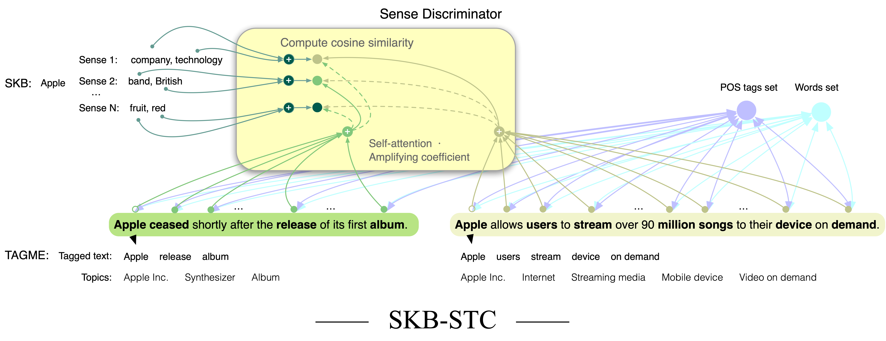
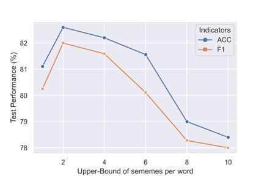

<p align="center">
    <br>
    
    <br>
<p>

<p align="center">
    <a href="https://colab.research.google.com/drive/1mbWcOZ5l97H5eSrFSH4dOUZVtsD5Sen4?usp=sharing">
        
    </a>
    <a>
        
    </a>
    <a>
        
    </a>
</p>

This repository provides the source codes of "The Endeavour to Advance Short Text Classification: Using Heterogeneous Graph Neural Network via Building Sememe-relationships (JSAI) 2022

<p align="center">
    <br>
    
    <br>
<p>

# Citation
```   
@inproceedings{李笑然2022意義素を用いた異種グラフニューラルネットワークによるショートテキスト分類の試み,
  title={意義素を用いた異種グラフニューラルネットワークによるショートテキスト分類の試み},
  author={李笑然 and 高野敏明},
  booktitle={人工知能学会全国大会論文集 第 36 回 (2022)},
  pages={2A6GS604--2A6GS604},
  year={2022},
  organization={一般社団法人 人工知能学会}
}

``` 
